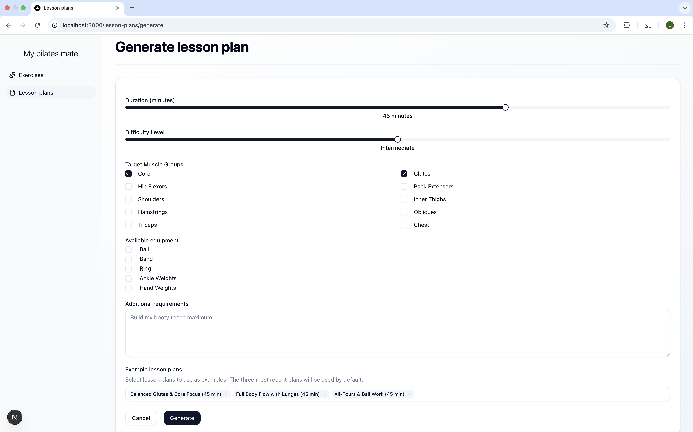
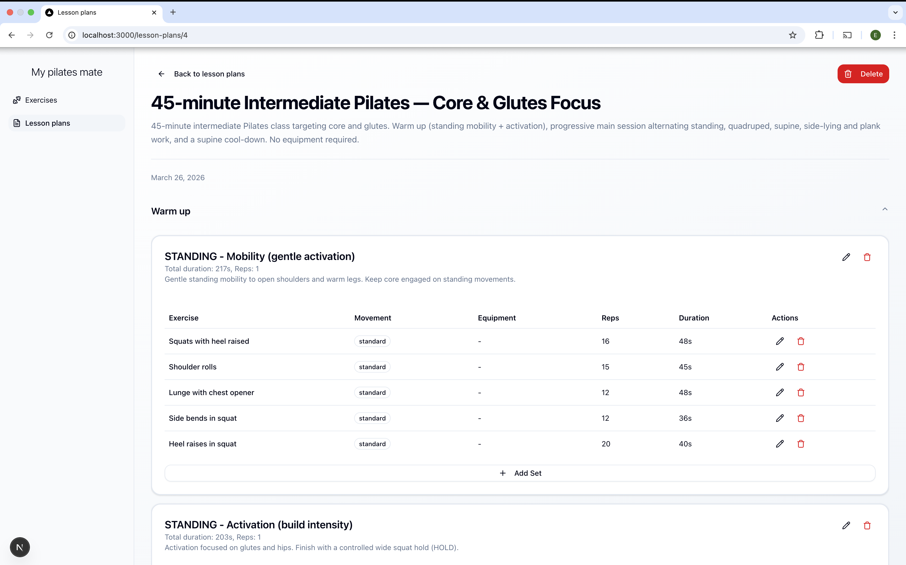

Web app for curating Pilates lesson plans - deployed at [thepilatesplanner.org](https://www.thepilatesplanner.org/)

My main objective was to practice using different AI coding tools, predominantly Claude Code. After
setting up and laying out the backend and frontend, around 50% and 95% was written by Claude respectively.

# Features
- Generate Pilates lesson plans based on requirements such as duration, difficulty and target muscle groups
- Refine and adapt lesson plans
- Automatically evaluate and optimise plans 





# Development

Run the app with:
```bash
make run
```

# Tech stack

- Backend: FastAPI, deployed as a container on EC2
- Frontend: Next.js, deployed on Vercel
